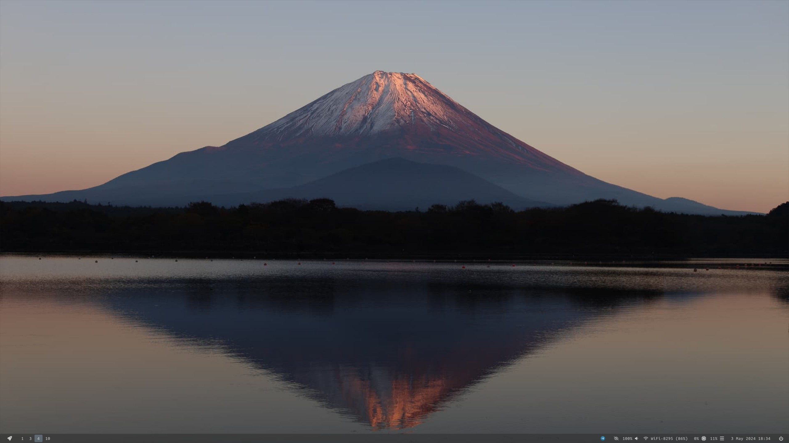
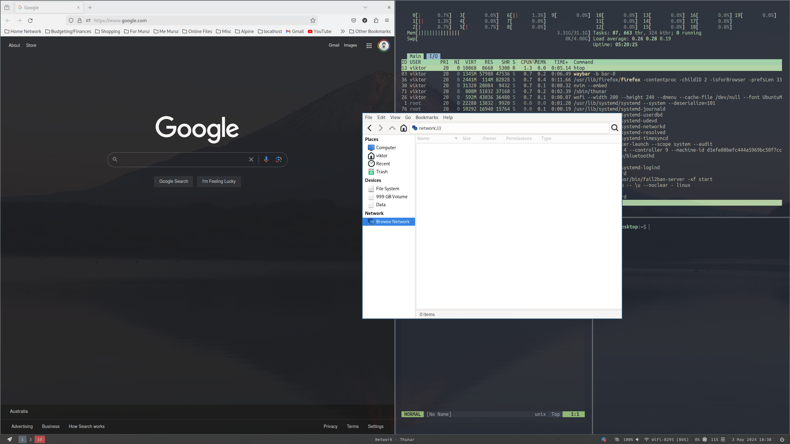

# .dotfiles
setup for local env and miscellaneous stuff.
This is pulled in via https://github.com/viktorybloom/ansible-local and run via the `local_playbook.yaml` script there. 

### Reminders
When setting up new instance, you may run into git public key issues (if you already have a key setup in your main dist).
To fix this, run `eval "$(ssh-agent -s)" \ ssh-add ~/.ssh/id_rsa`. 

### Notes
This setup assumes a base Arch distro install - Currently working with SwayWM and LY greeter. 
Reminder: edit `arch` script to stow the folders you are after. This will run `install`. 
For uninstall, run `./uninstall`

### Desktop

### Tiling

